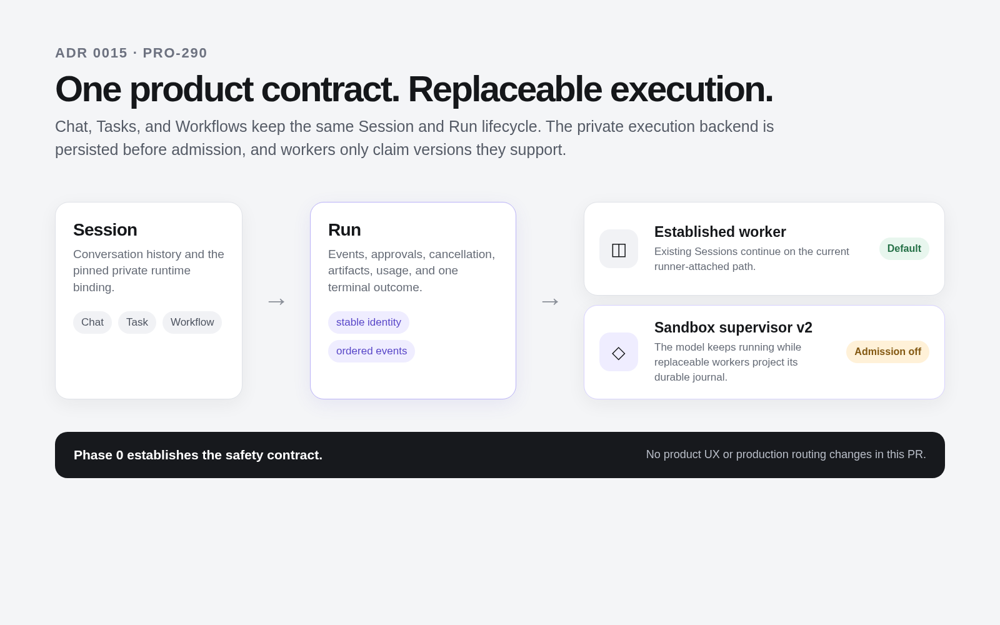

# ADR 0015: Durable execution behind Session and Run

- Status: Accepted; implementation and production admission remain gated
- Date: 2026-09-15
- Owners: runner maintainers
- Tracks: [PRO-290](https://linear.app/actaso/issue/PRO-290)
- Supersedes: ADR 0010's proposed topology and resolves its open design questions
- Informs: `docs/acp-support.md`, `docs/runner.md`, ADR 0001/0002/0004 execution vocabulary
- Related groundwork: #1782 (attempt-scoped fallback item ids), #1783 (acquisition telemetry),
  #1785 (batch-oriented event projection), #1867 (projector checkpoint restoration)

## Context

A Codex or Claude Code turn runs as an ACP adapter process inside a persistent E2B sandbox. The
runner holds the adapter's stdin/stdout as a live JSON-RPC channel tunneled through E2B's command
stream. If the runner process or that channel disappears, the live model invocation cannot be
reattached. Recovery fences the leftover process, loads the engine session, and sends another
model prompt. Persistence of the product Run therefore does not preserve its live execution.

The production incidents behind this decision have two independent causes:

1. Runner replacement interrupts a connection-owned execution. Deploy handoff and expired-lease
   recovery then re-execute the engine and can repeat side effects.
2. The adapter, agent commands, builds, browsers, dev servers, and guest control services compete
   for the same machine resources. A saturated workload can starve the control path needed to
   observe, cancel, or recover it.

On 2026-09-12, the runner deployed eight times. Its 230-second drain sits inside Render's
300-second shutdown window, while coding turns ran for a median of about six minutes and a p90 of
about 21 minutes. Fourteen days of production showed that 12.5% of completed Claude Code turns and
16.7% of completed Codex turns needed at least one retry. A week of logs contained 80 turn
reclaims and 25 shutdown handoffs across roughly 430 coding turns.

The TASK-1656 investigation sharpened the second problem. An 8 GB sandbox reached 99.992% of
available memory. Guest reboots restored responsiveness, but the resumed workload saturated the
machine again. Two Runs accumulated 11 engine attempts and three shutdown handoffs. The evidence
establishes severe memory pressure and guest timeouts; it does not establish which process the
kernel killed, or whether the guest was OOM-killing instead of spending its time in reclaim.

The existing recovery layers are individually useful, but they compensate for the same ownership
mistake: a durable Run rides on a connection held by the least durable process in the system.

## Decision

Keep **Session** and **Run** as the only product lifecycle. Add a private, versioned Execution
binding beneath them. A sandbox-resident supervisor owns a sandbox engine invocation and its ACP
channel. A replaceable v2 worker owns only a projection lease and may attach to the same execution
after another worker disappears.

```text
Session -> Run -> engine-neutral execution contract
                  |-> opencompany runtime
                  |-> sandbox runtime
                      |-> Claude Code adapter / ACP
                      |-> Codex adapter / ACP
```



The v2 worker is a separate deployment built from this repository. It shares product repositories
and pure projection logic with the established runner, but has a separate entry point, process
lifecycle, concurrency limit, database pool, health signal, and deploy schedule. Deploying v2 must
not restart established workers.

Production admission starts disabled. The first production cohort is new sandbox-backed Sessions
for an explicit actor allowlist. Existing Sessions remain on the established backend until a
separate migration has proved that their engine store, filesystem, pending interactions, and
recovery history can move safely.

### Non-negotiable invariants

1. A Run is admitted to exactly one persisted backend version before it becomes claimable.
2. A worker can atomically claim only backend versions it declares compatible with.
3. A projector lease change does not start an engine, consume an engine retry, or send a prompt.
4. At most one supervisor owns an execution identity and generation in one sandbox.
5. Every canonical event and projected cursor advance commit atomically and are idempotent by
   execution id, generation, and journal sequence.
6. A committed terminal journal record and required output exist before Run settlement.
7. The control process and its journal retain CPU, memory, and disk headroom when the workload is
   saturated.
8. Tool authority is bound to actor, workspace, Run, execution generation, allowed operations,
   and expiry. A worker lease id is not execution identity.
9. Cancellation intent is durable. Cancellation requested, delivered, and process termination
   observed are different facts.
10. Sandbox or supervisor loss is an explicit recovery event. It is never reported as transparent
    continuation of a model invocation that no longer exists.
11. There is exactly one logical terminal settlement and one usage/billing outcome, even if
    journal records or reconciliation work are delivered more than once.

## Product and runtime ownership

The vocabulary below is normative. Public APIs and the browser continue to expose Session, Run,
events, approvals, artifacts, usage, cancellation, and terminal outcomes. They do not expose
sandbox ids, ACP session handles, process ids, journal paths, or supervisor versions.

| Concept | Lifetime | Authority |
| --- | --- | --- |
| Session | Conversation/history plus a pinned private runtime binding | Canonical API and existing Session repository |
| Run | One accepted unit of work, ordered events, interactions, cancellation, artifacts, usage, and terminal outcome | Existing Run repository and state machine |
| Execution | One private realization of a Run, identified by a stable id and fenced generation | Execution repository and sandbox supervisor |
| Projector attempt | One worker lease that observes an Execution and projects it into the Run | `run_attempts` and worker lease |
| Engine invocation | One adapter prompt inside an Execution generation | Sandbox supervisor |

`run_attempts` remains an audit of worker/projector ownership. It must stop being interpreted as a
count of model invocations for v2. Engine invocation and recovery counts live in the private
Execution binding so a task-created continuation cannot reset the relevant failure history.

### Engine-neutral contract

The application-facing port has the following semantics. Exact TypeScript names may follow local
package conventions, but implementations may not weaken them.

```ts
type ExecutionRef = {
  runId: string;
  executionId: string;
  generation: number;
  backend: "runner_attached" | "sandbox_supervisor";
  backendVersion: number;
};

interface RunExecution {
  startOrAttach(input: AcceptedExecution): Promise<ExecutionRef>;
  observeAfter(ref: ExecutionRef, cursor: ExecutionCursor): AsyncIterable<ExecutionRecord[]>;
  requestCancellation(ref: ExecutionRef, intentId: string): Promise<void>;
  resolveInteraction(ref: ExecutionRef, resolution: InteractionResolution): Promise<void>;
  inspect(ref: ExecutionRef): Promise<ExecutionStatus>;
  reconcile(ref: ExecutionRef): Promise<ReconciliationResult>;
}
```

`startOrAttach` is idempotent for one execution id and generation. `observeAfter` may redeliver but
never reorder records. Cancellation and interaction resolution carry stable ids and are applied at
most once to the matching pending request. `inspect` distinguishes projector disconnect,
supervisor failure, sandbox loss, and terminal workload outcome.

The opencompany engine implements the same behavioral port without going through ACP or a sandbox.
Capabilities remain explicit rather than forcing every implementation through the lowest common
denominator.

## Persisted admission and routing

Phase 1 adds private, additive fields to the existing physical Session and Run rows. The migration
names may follow the schema's legacy physical prefix; the logical placement is fixed here.

### Session binding

Each `codex_chat_sessions` row gains a backend and version that are immutable after its first Run:

- `execution_backend`: `runner_attached` or `sandbox_supervisor`
- `execution_backend_version`: positive integer
- `supervisor_template_version`: nullable for `runner_attached`

The migration gives every existing row `runner_attached` version 1. The canonical API chooses the
binding while creating a new Session, from one reviewed admission policy using the persisted
initiating actor and workspace. Chat, manual Tasks, schedules, webhooks, Workflow continuations,
and Slack producers all enter through that policy. A continuation reuses the Session binding.

The admission configuration has three inputs: a global disabled-by-default v2 switch, an explicit
actor/workspace allowlist, and an admitted engine set. Missing, malformed, or unreachable
configuration selects `runner_attached` for a new Session and emits a diagnostic. It never changes
an existing `sandbox_supervisor` Session back to v1.

### Run binding

Admission copies the immutable Session selection onto `codex_chat_turns` before setting the Run to
`queued`:

- `execution_backend` and `execution_backend_version`
- `execution_id`, generated once at Run admission
- `execution_generation`, initially 1
- `supervisor_protocol_version` and `journal_protocol_version`
- `execution_deadline_at`, calculated once from the accepted request
- `projected_execution_generation` and `projected_journal_sequence`
- `cancellation_delivered_at` and `termination_observed_at`
- `recovery_chain_id`, inherited by task-created continuations of the same work

The v1 compatibility migration backfills `runner_attached` version 1. Nullable execution-specific
fields are valid only on a legacy v1 row; check constraints reject a queued v2 row without the
complete binding. Diagnostics expose the admission rule, actor/workspace match, backend/version,
execution id/generation, protocol versions, and worker compatibility decision without exposing
credentials.

### Claim and cleanup compatibility

Worker compatibility is a required argument to the claim repository, not a flag interpreted after
claim. The candidate query extends its existing `FOR UPDATE SKIP LOCKED` predicate with an exact
backend/version allow-set. The update repeats that predicate, so a config reload or race cannot
claim an unsupported Run between selection and mutation.

Deployment order is mandatory:

1. Add the fields and defaults while no v2 admission exists.
2. Deploy established workers whose claim, retry, cancellation recovery, self-heal, terminal
   sandbox sweep, and managed-sandbox reconciler all select only `runner_attached` version 1.
3. Verify every old binary has drained. A release check queries active worker versions and refuses
   to enable v2 while an unrestricted claimer is alive.
4. Deploy the v2 service with `sandbox_supervisor` version 1 support and admission still disabled.
5. Run staging fault tests, then enable the explicit canary admission policy.

Both services may observe the same database and E2B account. They may not claim, fence, pause,
reboot, or kill the other backend's execution. E2B metadata therefore adds backend version and
execution identity to the existing namespace/owner metadata, and every reconciler verifies those
fields against the persisted binding before mutation.

## Sandbox supervisor

The supervisor is a pinned, independently versioned asset baked into a v2-only E2B template. The
worker verifies the template, supervisor binary digest, supervisor protocol, journal protocol, and
resource-layout version before admission. Established templates are never rebuilt as a side effect
of a v2 deploy.

The worker delivers a single-use bootstrap grant over the root-owned control socket. The grant is
bound to the actor, workspace, Session, Run, execution id/generation, sandbox id, template digest,
and a short expiry. The supervisor exchanges it once for its renewable execution capability. No
bootstrap grant, signing secret, provider credential, or renewable capability is written to the
manifest, journal, process arguments, or logs.

The template starts a root-owned control service outside the agent workload slice. The v2 worker
writes a validated execution manifest through a narrow control command. The service then:

1. Acquires an exclusive lock for `(executionId, generation)`.
2. Creates the execution directory, writes and fsyncs its immutable manifest, and fsyncs the parent
   directory before starting the adapter. This closes the process-start/identity-persistence gap.
3. Starts the pinned ACP adapter in the bounded workload slice, performs `initialize`, applies the
   accepted configuration, creates or loads the engine session, and sends the prompt once.
4. Owns adapter stdin/stdout, requests, notifications, steering, cancellation, and terminal
   observation until the generation ends.
5. Records its pid, process start time, adapter/session identity, deadline, and resource cgroup.
   Pid alone is never accepted as identity.

A second start for the same identity attaches to the manifest and journal. A different generation
cannot start while the prior generation's lock holder is alive. Generation replacement on a live
sandbox first records cancellation, observes or forcibly terminates the old adapter tree, records
that fact, and only then publishes the new current-generation manifest. A sandbox loss permits a
new generation only after central reconciliation has marked the old sandbox unavailable and
recorded the side-effect uncertainty boundary.

The deadline is absolute and persisted in the accepted manifest. The supervisor enforces it from
wall-clock time; worker replacement cannot reset it.

## Journal, projection, and checkpoints

Each execution generation owns an append-only journal. Every line is a bounded envelope:

```ts
type JournalRecord = {
  protocol: 1;
  executionId: string;
  generation: number;
  sequence: number;
  recordedAt: string;
  kind: string;
  stableId?: string;
  payload: unknown;
  payloadBytes: number;
  checksum: string;
};
```

Sequences begin at 1 and increase by one. Records end with a newline and include the byte length
and checksum of their canonical payload. A reader ignores a final non-newline-terminated record.
A checksum, identity, or sequence failure before the tail marks the journal corrupt and blocks
terminal settlement; it cannot be skipped or converted into a fabricated terminal state.

Journal payloads use the existing normalized/redacted event contract before persistence. Raw ACP
frames, environment values, authorization headers, gateway tickets, provider credentials, and
secret-like tool fields are never journaled. Where replay needs a protected value, the record holds
an opaque centrally encrypted reference with narrower authorization than the execution. Local
directories are root-owned and mode 0700; journal files are mode 0600. Diagnostics may emit ids,
sizes, timings, categories, and checksums, but never payload content.

### Durability and acknowledgement

- Interaction requests, cancellation observations, external invocation intents/results, artifact
  identities, usage, and terminal records are fsynced before the supervisor acknowledges or acts
  across a controlled boundary.
- Ordinary model notifications are appended before projection and fsynced within 250 ms or 64 KiB,
  whichever comes first. An orderly adapter exit flushes the remaining batch before its terminal
  record.
- The state summary is derived from the journal, written to a temporary file, fsynced, renamed,
  and followed by a directory fsync. It is an index, never evidence that can override the journal.
- One record is at most 1 MiB after normalization. Oversized provider payloads become a bounded
  error record plus a separately stored artifact when safe; they are not silently truncated into
  a different semantic event.

The local journal is capped at 256 MiB per generation, with 16 MiB of filesystem headroom reserved
for control and terminal records. During a projector/database outage, the supervisor keeps draining
ACP into the bounded journal. At the data cap it cancels the workload and records
`journal_capacity_exceeded`; it does not fill the disk until the control service becomes
unresponsive. Settled local generations are retained until their replicated journal and final
workspace checkpoint are verified, then for at most seven days for canary diagnosis. A Session or
workspace deletion, applicable content-retention deadline, or capability revocation can shorten
that window. Replicated records follow the owning Run's content-retention and deletion policy and
never become a second indefinite transcript store.

### Idempotent projection

The worker reads after the Run's committed `(generation, sequence)` cursor. In one database
transaction it:

1. stores the immutable raw execution record or proves that the same identity/checksum exists;
2. appends zero or more canonical `run_events` using
   `(executionId, generation, sequence, semanticIndex)` as the deduplication identity;
3. updates Messages, approvals, artifacts, usage, and terminal evidence as required; and
4. advances the Run cursor to that exact record.

A conflict with different bytes is corruption, not a duplicate. Lease authority is checked in the
same transaction. Losing the projector lease rolls the transaction back and lets the next worker
redeliver the batch.

A stale heartbeat, silent journal, unreadable guest, or adapter process exit cannot substitute for
a committed terminal record. Settlement requires the terminal record, normalized outcome, final
usage, required assistant output, and generation match. The existing settlement compare-and-set
continues to guarantee one logical Run result and one billing outcome.

### Durability outside the sandbox

Sandbox disk survives worker replacement and pause/resume, but it is not the durability boundary
for sandbox destruction. The supervisor sends raw journal batches to a generation-authorized
central ingest independently of projector ownership; the tailing worker can perform the same
idempotent replication as a fallback. The projector consumes the central copy when available and
otherwise tails the sandbox. V2 also checkpoints workspace/runtime state to private object storage.

Critical records wait for central acknowledgement before the supervisor crosses the controlled
boundary they protect. Ordinary notification batches push every second or at 256 KiB. A central
outage leaves the local journal authoritative and bounded as described above; the advertised RPO
does not resume until central acknowledgement does.

The initial objectives are:

- journal RPO: at most one second or 256 KiB of ordinary model notifications;
- interaction, external-write intent/result, cancellation, usage, and terminal RPO: zero after
  acknowledgement;
- workspace/runtime checkpoint RPO: at most 60 seconds while active and zero after a successful
  terminal checkpoint;
- projector replacement RTO: two Run lease TTLs at p99;
- sandbox-loss reconciliation RTO: ten minutes at p99, reported as recovery rather than continuous
  execution.

An execution whose sandbox disappears is lost even if every journal record was replicated. A new
generation may restore the last verified checkpoint and engine session where supported, but it is
a recovery with an explicit gap and a preserved prior generation. It never claims that the lost
model invocation continued.

## Resource isolation feasibility and contract

E2B fixes vCPU and RAM on the template, and the SDK exposes whole-sandbox CPU, memory, and disk
metrics. Current upstream envd also uses cgroup v2 for SDK-spawned user and PTY processes and
reserves at most 128 MiB from their memory ceiling. Those facilities do not by themselves isolate
an opencompany supervisor from the adapter and its descendants. This conclusion is based on the
[E2B template resource controls](https://e2b.dev/docs/sdk-reference/cli/v1.0.9/template),
[sandbox metrics API](https://e2b.dev/docs/sdk-reference/js-sdk/v2.6.2/sandbox), and the
[upstream envd cgroup layout](https://github.com/e2b-dev/infra/blob/main/packages/envd/main.go),
reviewed 2026-09-15. The hosted envd version must still be probed; upstream source is not proof of
the production guest.

The v2 template must provide three separately measured domains:

| Domain | Contains | Required behavior |
| --- | --- | --- |
| Guest control | envd and E2B-required services | Remains reachable for status and recovery |
| opencompany control | supervisor, journal writer, control socket | Reserved memory/CPU and bounded disk writes |
| Workload | ACP adapter, model CLI, shell commands, builds, browsers, dev servers, Docker daemon/containers, and every descendant | Enforced per-size memory/CPU/pid limits and OOM attribution |

The supervisor starts the adapter inside the workload slice so all ordinary descendants inherit
the limit. The root-owned template service, not the sandbox user, owns cgroup placement. Docker is
part of the boundary: membership in the current template's rootful `docker` group is effectively
root authority and is incompatible with this containment contract. The first canary removes direct
access to that socket. Docker can return through rootless mode inside the workload subtree or a
narrow broker that enforces the cgroup parent and rejects privileged, host-mount, host-pid, and
host-network escapes. If parity requires unrestricted rootful Docker, the workload moves to a
separate microVM. If the hosted template cannot provide the full boundary, v2 production admission
stays disabled and the supervisor moves to a separately isolated control resource.

Limits are selected per `small`, `standard`, and `large` template only after a hosted probe. The
probe records cgroup hierarchy/controllers, effective memory and CPU limits, delegation,
user/privilege behavior, Docker containment, `memory.events`/OOM counters, and supervisor response
under pressure. It must cover nested shells, detached processes, Playwright, dev servers, and
containers. Node heap size is not treated as machine or process-tree usage.

On saturation, the supervisor records available memory, workload usage, pressure, process-tree
identity, exit cause, and OOM counters where available; cancels or terminates the bounded workload;
and remains responsive long enough to publish status. A guest reboot probe proves guest
responsiveness only. Recovery is complete only after execution and workspace reconciliation.

## Host tools, approvals, and cancellation

The current sandbox MCP ticket carries a Run attempt id and worker lease id. That is appropriate
for a runner-owned invocation and wrong for an execution that outlives projector ownership. V2
replaces it with a revocable execution capability containing:

- actor and workspace ids;
- Session and Run ids;
- execution id and generation;
- allowed operation families and host-tool contract version;
- issued-at, expiry, renewal id, and key id.

The gateway authorizes every mutation against central state: the Run is active, the execution
generation is current, cancellation has not revoked authority, and the requested operation is in
scope. The supervisor obtains short-lived renewals through its control identity. Projector lease
replacement neither revokes nor broadens the execution capability. Generation change,
cancellation, terminal settlement, Session closure, actor/workspace access loss, or an operational
kill switch revokes it.

Interaction requests have stable ids derived from execution identity and the engine request id.
The supervisor persists a pending request before exposing it. Approval resolution commits once in
the central Run approval state and is delivered with the same stable id. The supervisor records the
resolution before replying to ACP. Duplicate resolution delivery returns the recorded result;
different content for the same id is rejected.

Live ACP permission and elicitation requests keep the adapter invocation alive and survive
projector replacement in the journal. A connected action set to Ask in a background Task keeps the
existing parking contract: persist the exact invocation, finalize that engine invocation as
paused, and park the Run/Task. Approval or denial executes or records the saved invocation at most
once, then a new execution generation may resume the model with that result. That generation change
is explicit recovery, not projector takeover, and never makes Ask actions autonomous.

Cancellation follows this sequence:

1. The API atomically records a stable cancellation intent on the Run.
2. The current projector forwards it, while the supervisor also polls centrally so a disconnected
   projector cannot strand the request.
3. The supervisor records receipt, sends ACP `session/cancel`, and starts a bounded termination
   timer.
4. It records graceful or forced process-tree termination separately.
5. Projection settles the Run only from the terminal journal evidence.

Races with approval, completion, projector takeover, and a second cancellation are resolved by
stable ids and compare-and-set state transitions. Pending approvals are canceled when cancellation
wins. Central persistence supplies the total order: a terminal record already ingested and accepted
before the cancellation transaction remains terminal and the cancellation command reports that
settled result. If cancellation commits first, later terminal projection must settle as canceled
while preserving any local completion evidence for diagnosis. Local timestamps never decide the
winner.

## Failures, retries, and side effects

All engines normalize private failures into these categories:

| Category | Examples | Default response |
| --- | --- | --- |
| `setup_acquisition` | sandbox allocation, template verification, bootstrap before prompt | bounded retry before a model invocation |
| `projector_transport` | worker loss, journal tail disconnect, database outage | attach/tail; no engine retry or prompt |
| `resource_saturation` | workload memory/CPU/pid limit, journal capacity | stop workload; remediate or explain, no blind repeat |
| `guest_unavailable` | sandbox control path or VM lost | reconcile, record gap, decide whether a new generation is safe |
| `adapter_failure` | ACP protocol or adapter crash | preserve evidence; retry only before prompt or with explicit recovery policy |
| `authentication_authorization` | expired/revoked capability, account access loss | stop and request repair; never bypass |
| `terminal_workload` | model-declared failure, deadline, user cancellation | settle once with normalized outcome |

Recovery budgets belong to `recovery_chain_id`, not merely the latest Run. A task-created
continuation inherits the resource-saturation and guest-loss history for the same workload.
Repeated saturation requires a changed resource limit, reduced workload, or an explained stop.
Creating a fresh Run does not hide the evidence or grant a fresh automatic retry budget.

External invocations persist intent, stable invocation id, provider idempotency key where
available, and result. A write with committed intent but no result is `uncertain`; reconciliation
must inspect the provider or ask the user before another write. The system promises at-most-once
delivery to its own gateway and exactly one logical settlement. It does not promise exactly-once
arbitrary shell, network, or provider side effects.

## Engine capability and legacy dependency inventory

The backend abstraction preserves differences instead of branching the product lifecycle.

| Capability | opencompany | Codex ACP | Claude Code ACP | V2 requirement |
| --- | --- | --- | --- | --- |
| Stable product Session/Run | Existing native path | Existing coding rows | Existing coding rows | unchanged |
| Start/load engine session | Native model history | ACP `session/new`/`load` | ACP `session/new`/`load` | supervisor owns it |
| Model/reasoning configuration | Native provider config | ACP config options | ACP config options | accepted config in manifest |
| Permission mode | Host tool policy | ACP `mode` | ACP `mode` | capability and interaction parity |
| Steering | Native input continuation | `_session/steering` | no adapter steering method today | explicit capability result |
| Collaboration/plan mode | Native agent control | ACP `collaboration_mode` | unavailable | explicit capability result |
| Goal reporting | Native goal state | normalized result/goal | normalized result/goal | journal stable goal updates/outcome |
| Cancellation | Abort + durable Run intent | ACP `session/cancel` | ACP `session/cancel` | local delivery and termination evidence |
| Host tools/artifacts/actions | In-process host ports | Sandbox MCP gateway | Sandbox MCP gateway | execution-scoped authority |
| Ask approvals | AI SDK continuation | park/resume invocation | park/resume invocation | stable interaction id, same UX |

The v2 cutover must inventory and then retire or adapt these current lifecycle dependencies:

- `claimNextCodexChatTurn` currently increments one attempt counter for worker claims, approval
  resumes, deploy handoffs, and engine retries.
- `runClaimedTurn` currently creates a `run_attempts` row and executes the engine in the claiming
  worker.
- `claimCodexChatRecovery`, `buildClaudeChatRecoveryTask`, and recovery prompts reconstruct a lost
  invocation by prompting again.
- `fenceCodingSessionEngine` kills leftover adapter processes before recovery.
- heartbeat cancellation revokes a worker lease so a replacement can fence and settle.
- task approval resumes currently queue the same Run with attempt/lease-bound host authority.
- terminal sandbox sweeping, self-heal, and managed-sandbox reconciliation reason about Session
  state without an execution backend/version.
- runner shutdown drains and hands off active coding turns inside Render's five-minute window.
- the current runner entry point starts coding work together with schedules, ingestion, billing,
  cleanup, and reconciliation workers.

Phase 1 adds backend fences to every one of these paths before Phase 2 introduces the new
implementation. Phase 5 removes recovery prompts and v1-only fencing only after established
Sessions have drained or migrated.

## Deployment, capacity, and rollout

The v2 service uses a dedicated Render service and a dedicated process entry point that starts only
the v2 execution projector, its backend-aware sandbox reconciler/billing hooks, and required HTTP
control routes. It does not start schedules, event ingestion, Slack delivery, Brain workers, or the
v1 coding worker.

The first production canary is deliberately small:

- one service instance;
- projector concurrency 1;
- database pool maximum 4;
- at most one active v2 execution per actor and two per workspace;
- one allowlisted actor, new Sessions only, Codex first;
- v1 remains the default and owns all existing Sessions.

These limits prevent an account-only canary from exhausting shared E2B concurrency, database
connections, model quotas, or event throughput. Raising any cap is a rollout decision with capacity
evidence, not a code deploy side effect.

### Phases and gates

| Phase | Deliverable | Gate before proceeding |
| --- | --- | --- |
| 0 — contracts and isolation design | This ADR: ownership, state, schema, resource, auth, durability, rollback, failure, capability, and SLO contracts | Maintainer review accepts the invariants and hosted isolation probe plan |
| 1 — compatible admission infrastructure | Additive bindings and diagnostics; all v1 claim/retry/cancel/reconcile/sweep paths restricted; v2 admission disabled | Tests prove v1 cannot claim or clean v2, v2 cannot claim v1, rolling migration preserves existing traffic, and unrestricted old workers have drained |
| 2 — v2 in staging | Supervisor, journal/projector, checkpoints, resource boundary, interactions, settlement, independent deployment | Deterministic contract suite and hosted fault matrix pass for every supported size |
| 3 — actor-only canary | Allowlisted actor's new Codex Sessions | Normal and deliberately interrupted Runs pass; no existing Session changes backend; capacity and control-path SLOs hold |
| 4 — engine parity and limited cohort | Claude Code plus Chat, Task, Workflow, schedule, webhook, and continuation validation | V1/v2 comparison meets error, latency, continuity, approval, usage, and rollback gates |
| 5 — expansion and retirement | Deliberate cohort expansion, drain/migrate compatible Sessions, delete v1 recovery machinery | Target reliability holds over a representative window and rollback no longer depends on deleted state |

The hosted fault matrix includes: worker `SIGKILL` during output, pending approval, external tool
intent, cancellation, terminal projection, and checkpoint; projector lease expiry; database outage
until journal cap; truncated and corrupt journal tails; supervisor `SIGKILL`; adapter crash; workload
memory/CPU/pid pressure; Docker/container escape attempts; guest pause/resume; sandbox loss; and
simultaneous v1/v2 deploy overlap. Assertions cover no second prompt on projector loss, continuous
sequence, stable interaction ids, one settlement, correct usage, bounded control latency, preserved
uncertainty, and no orphan processes.

## Reliability measures

The 99.99% target is an infrastructure continuity objective, not the percentage of Runs that end in
`succeeded`. Model errors, user cancellation, invalid code, and provider rejection are valid
terminal outcomes and do not measure whether infrastructure preserved the invocation.

Primary SLIs:

- **Execution continuity:** accepted v2 engine invocations that reach a committed terminal record
  without an infrastructure-caused second prompt or unplanned generation.
- **Projector takeover continuity:** injected or organic projector replacements that reattach to the
  same execution id/generation and cursor.
- **Control availability:** cancellation/status probes answered within two seconds while the
  workload is at its enforced memory and CPU limit.
- **Projection correctness:** journal records projected once semantically, with no gap, conflicting
  duplicate, or multiple terminal settlement.
- **Durability:** observed RPO/RTO against the objectives in this ADR.

Long-term objectives are 99.99% execution continuity, 100% correct terminal settlement, and 100%
preservation of centrally acknowledged external-write/interaction evidence. Canary gates require
all planned interruption tests to pass, zero cross-backend claims or duplicate settlements, zero
unexplained journal gaps, p99 control response below two seconds under pressure, and p99 projected
event latency below two seconds when the database is healthy. Organic samples are reported with
their denominator and confidence interval; a small canary never claims to prove four nines.

## Rollback

Rollback stops new admission first. Disabling the canonical admission switch makes every new
eligible Session v1 while preserving existing v2 bindings. It does not rewrite or strand a v2
Session.

The v2 service remains deployed long enough to drain or explicitly stop its Sessions. If its code
is bad but supervisors are healthy, roll the projector back to the last version compatible with
the persisted supervisor/journal protocol. If supervisors are bad, revoke their capability key,
record cancellation, terminate the bounded workload, checkpoint what remains, and settle or mark
recovery required from central evidence.

Schema and journal changes are additive through the canary. V1 readers continue to understand v1
rows; v2 rows are fenced away. Supervisor/template versions are immutable and retained through the
rollback window. No rollback converts an existing v2 binding to v1 in place. A later migration may
move a settled/idle Session only after compatibility tests and an explicit audit record.

## Alternatives considered

**Longer drains or slower deploy cadence.** Render caps the runner shutdown window at 300 seconds,
while ordinary turns exceed it. A separate deployment reduces exposure but does not preserve an
invocation when that deployment changes.

**Reconnect an E2B background command without a journal.** Output can be lost between disconnect
and attach, JSON-RPC request ids remain ambiguous, and pending interactions have no durable owner.
Closing those gaps recreates the journal and supervisor design implicitly.

**Use the sandbox disk as the only durable store.** It survives the worker failure we see most
often, but not sandbox destruction. It cannot satisfy acknowledged-interaction, external-write,
terminal, or checkpoint recovery guarantees.

**Move the adapter into the guest without resource isolation.** It fixes runner ownership while
retaining TASK-1656's starvation mode. The control path must have an enforceable resource reserve.

**A message broker between runner and sandbox.** It adds credentials and another durability domain
without removing the need for local ordering and a bounded offline journal. Tail-first is simpler;
push can be added later for latency.

**Replace ACP or force the opencompany engine through it.** The incidents implicate connection and
resource ownership, not ACP semantics. The shared port can have native and ACP-backed
implementations.

## Consequences

- Runner deploys interrupt projection instead of model execution.
- Session and Run remain the only product lifecycle and UX; v2 internals stay private.
- Projector attempts, engine invocations, and recovery generations become distinct facts.
- The sandbox template and release process gain a pinned control service, journal protocol,
  resource layout, hosted fault gate, and checkpoint storage.
- Cancellation, approvals, host tools, settlement, and billing require execution-scoped fencing.
- Sandbox loss still loses the live model invocation. V2 makes the loss explicit, bounded, and
  recoverable from preserved evidence rather than describing a retry as uninterrupted execution.
- Implementation must land in gated phases. Accepting this ADR does not authorize production
  admission or a broad cutover.
