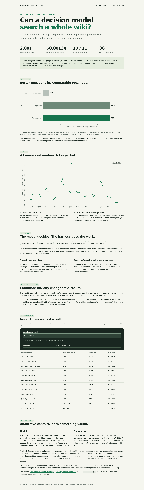
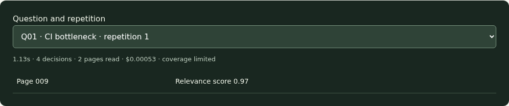
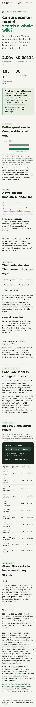

# Jev wiki query experiment

`wiki({ command: "query", query: "a detailed question", limit: 10 })` now uses Jev to traverse
the authorized wiki tree, score page excerpts, follow internal links, and return 0–10 `matches`.
Read the matches before answering. External source pointers remain with the parent session's
permission-aware connectors; source bodies are not fetched by this experiment.

The [interactive report](report.html) contains graphs, methodology, limitations, and anonymized
recorded results. [Metrics](metrics.json) contain no private page titles, bodies, or source IDs.
The [social card](social-card.png) is ready to share. No public post has been made.

## Findings

- 216 pages and 22 folders, 12 questions × 3 repetitions.
- Median 1.9965s, nearest-rank p95 5.212s; mean gateway cost $0.0013433/query.
- 10/11 preselected reference pages retrieved in each repetition. Hand-chosen keywords: 10/11;
  full-sentence existing search: 1/11. These are reference-page recall measurements, not precision.
- Two easy unanswerable questions returned zero matches in all six runs.
- 21/36 runs hit a coverage limit. Limits include branch pruning and 12,000-character excerpts.
- Total measured spend including pilot, diagnostics, and API checks: $0.052750572 of $5.
- An index-only prompt failed; explicit path/title binding fixed the diagnostic and scored runs.

## Runtime boundaries

The core service authorizes the actor and selected wiki before loading its tree. All page reads
use that scope, and model output can only score known candidates. The model has no write tools,
network fetch, connector credentials, or recursive access to the parent agent. Untrusted page
content is labeled as evidence. Source pointers are returned, not silently opened.

Each query has a 20-second model deadline, 20-evaluation limit, 48-page read limit, eight expanded
folders per level, three content/link rounds, and a conservative $0.05 request-reservation ceiling.
The gateway adapter disables retries and requests zero data retention. It validates usage metadata
and sanitizes provider errors. Existing `VERCEL_AI_GATEWAY_API_KEY` wiring is reused; no new env
variables or schema migrations are required. The runner allows 30 seconds for the API round trip.

Relevance thresholds (0.35 navigation, 0.70 inclusion) are experimental and uncalibrated. Empty
results do not prove that no evidence exists. `stats.truncated` reports reached coverage limits.
The tool returns page identities and source pointers, not generated answers or page bodies.

## Reproduce privately

Export the authorized wiki into an ignored snapshot with `nodes` (path/title/type) and `pages`
(path/title/body). Supply question objects with `id`, `question`, and preselected `anchors` paths.
Keep all snapshots, labels, and raw results private. From the repo root:

```sh
bun --env-file=.env.local packages/agent/scripts/benchmark-wiki-query.ts \
  .context/jev/wiki.json .context/jev/questions.json .context/jev/new-results.json 3
```

The harness refuses existing output files, serializes runs with an exclusive budget lock, and
persists conservative reservations in `budget.json` alongside results. Reuse that directory to
preserve the cumulative $5 limit. Failed calls retain their reservation. The initial $0.10 reserve
covers diagnostics; budget actual costs and reservations are different quantities.

Measured timings use in-memory snapshot reads, not production database reads. Search baselines
used the live wiki once per question; their transport times are not compared with Jev's. Labels
are author-selected and incomplete, not independent human relevance judgments. There is no LLM
baseline, held-out corpus, realistic negative set, or full precision assessment. Repetitions may
benefit from provider caching. Larger independent evaluation is required before quality claims.

## UX screenshots







## X draft

We tried Jev as a wiki search agent over 216 real pages. Across 36 runs: 2.00s median, 5.21s p95,
and $0.00134/query. It returned relevant pages for the main agent to read. Total experiment cost:
about five cents.

It found 10/11 preselected reference pages—the same as hand-chosen keywords. Raw sentence search
found 1/11. Useful for accepting detailed questions, but this small test doesn't prove better
recall than keyword search.

The surprise: candidate IDs matter. Index-only questions failed. Explicit page paths and titles
fixed our diagnostic. 21/36 runs hit coverage limits, so exhaustive search remains unproven.
Full methodology and graphs in the report.
