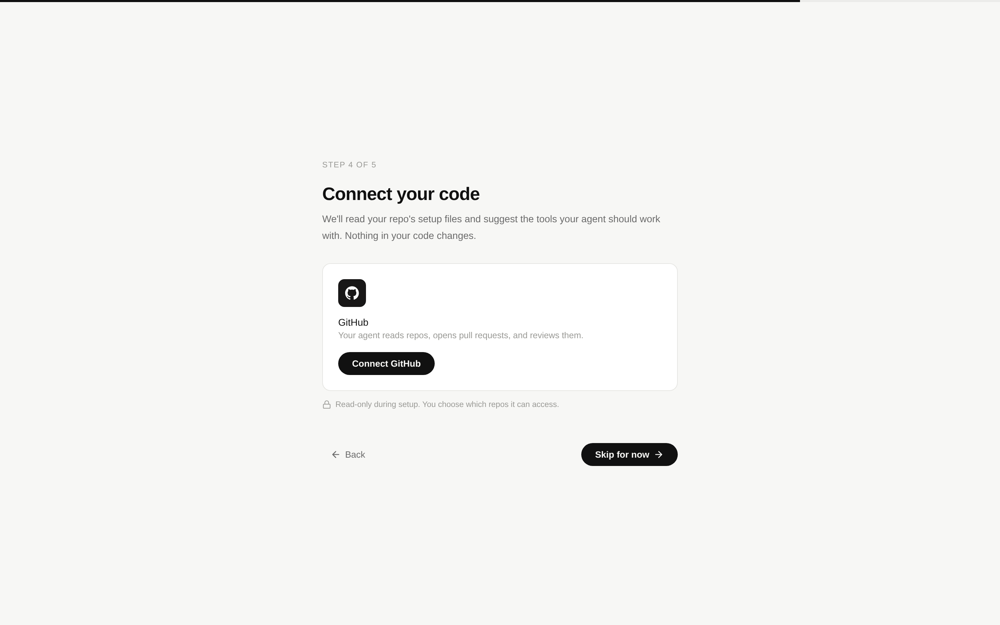
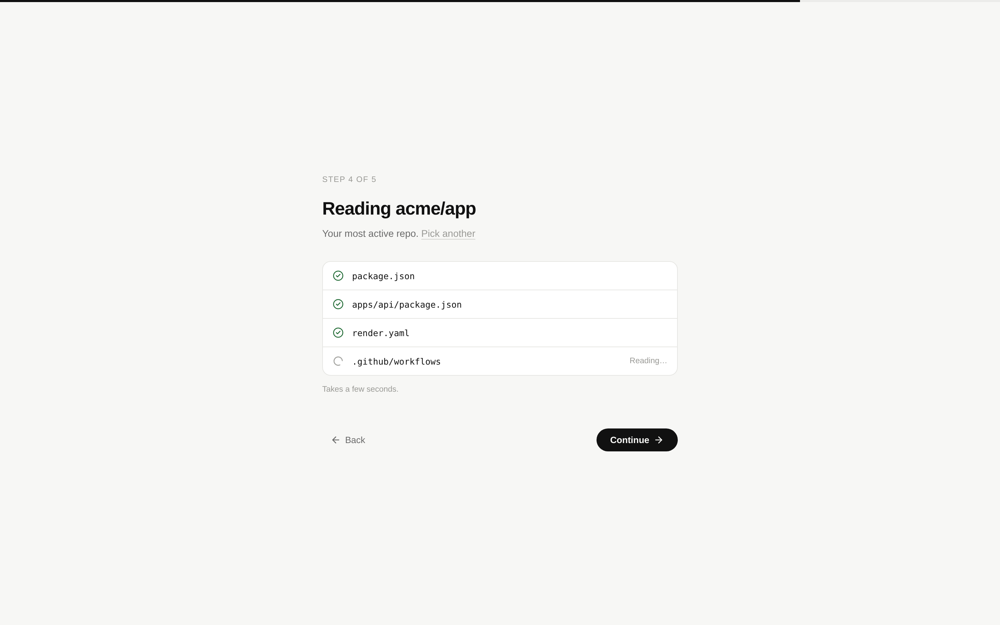
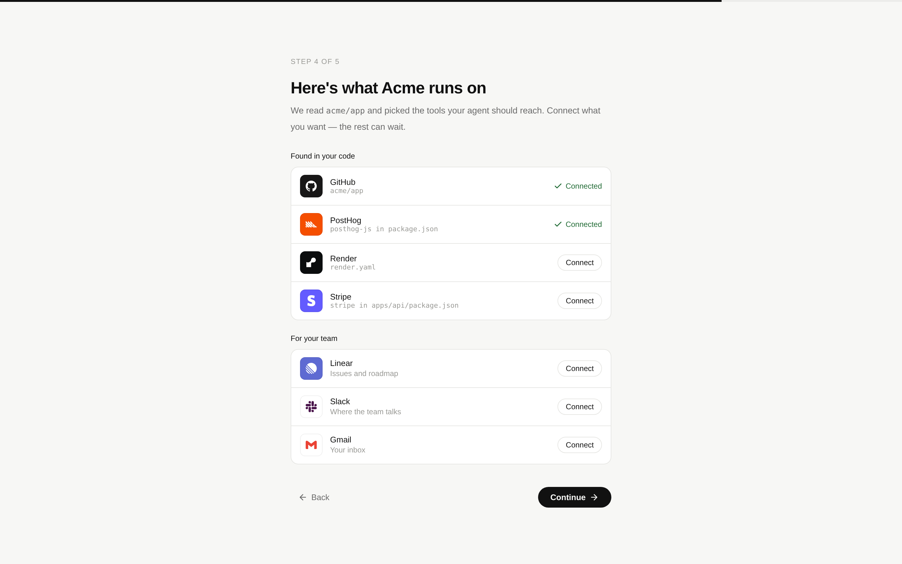
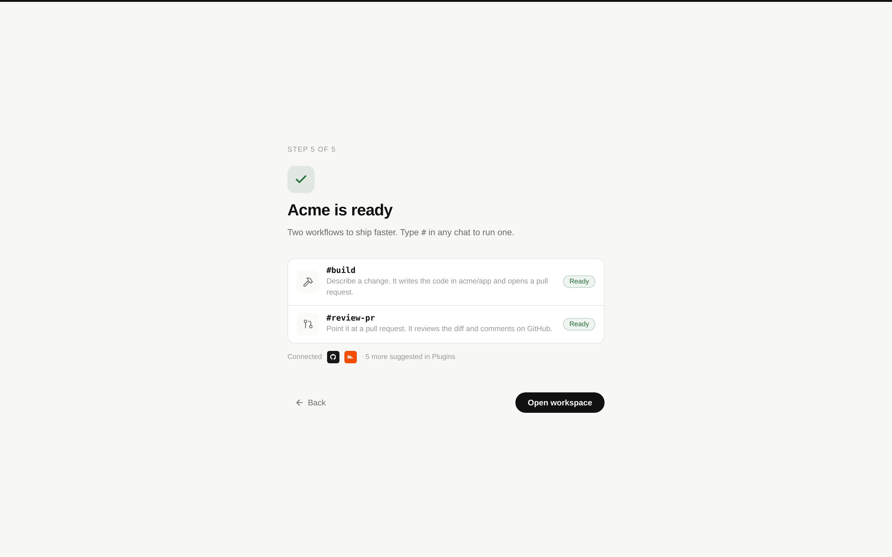
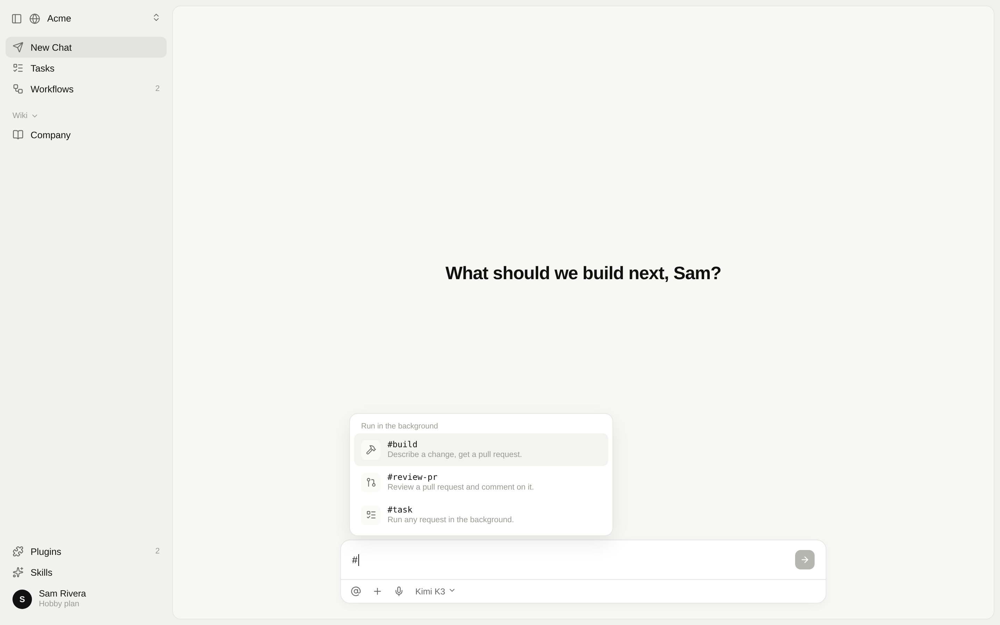

# Starter setup for technical founders

Status: proposal. The first version covers technical founders only. Clickable prototype:
[`starter-kits/prototype.html`](./starter-kits/prototype.html). It opens straight in a browser with
no build step.

## Problem

A new workspace starts empty. Workspace creation seeds only the Company Wiki. The first screen a
new user sees is "What should we build next?" with nothing beneath it.

Users tell us they want useful defaults. A technical founder should arrive with:

- the right tools connected, and
- one obvious way to ship something,

and get to a first "aha" within about 30 seconds.

An earlier version of this proposal offered a general kit of skills, plugins, a workflow, and a
company agent. That turned out to be too many concepts at once. This version keeps only two things:

- **Plugins**, chosen from the user's own code.
- **Two workflows** the user runs by hand.

## Principles

1. **Use what they already have.** The repo already says what the company runs on. Read it instead
   of asking.
2. **Only real content.** The setup creates ordinary plugins and workflows. It adds no new
   "template" object and no new page. Undoing it means deleting those items the normal way.
3. **Every suggestion explains itself.** Each suggested plugin names the file that caused the
   suggestion, for example `render.yaml`.
4. **No new steps.** The setup replaces the existing plugins step. The owner flow stays at five
   steps: profile, workspace, subscriptions, code, finish.

## The flow

**1. Connect your code** (step 4, replacing "Give your agent some tools")

- The step is a single "Connect GitHub" card.
- A note says setup is read-only.
- "Skip for now" keeps today's behavior.

**2. Read the repo**

- We pick the user's most recently pushed repo automatically. A "Pick another" link lets them
  change it.
- We read a handful of setup files and show each one as it is read.
- This takes seconds and does not call a model.

**3. Suggested plugins**

The screen has two short lists:

- **Found in your code:** GitHub, plus whatever the scan detected, each with the reason it was
  suggested.
- **For your team:** Linear, Slack, and Gmail. We suggest these to every technical founder.

Each row has a Connect button. Anything the user leaves unconnected stays suggested on the Plugins
page.

**4. Acme is ready**

The finish screen shows the two workflows and which plugins are connected.

**5. Home**

- Two starter prompts sit under the heading: `#build …` and `#review-pr …`.
- Typing `#` opens the existing workflow menu, which now contains both workflows.

## Plugin detection

Detection is a fixed rule table, so the same repo always gets the same suggestions.

- **Which files:** only manifests and config files: every `package.json` up to two directories
  deep, `pyproject.toml`, `requirements*.txt`, `go.mod`, and `Gemfile`, plus the files named
  below.
- **How:** one recursive git-tree call, then fetching only the matching files.
- **Which plugins:** only official plugins that can be connected today. A plugin with a
  `connectionUnavailableReason`, such as Vercel, is not suggested.

| Plugin | Suggested when the repo contains |
| --- | --- |
| PostHog | `posthog-js`, `posthog-node`, or `posthog` (Python) |
| Render | `render.yaml` |
| Stripe | `stripe` or `@stripe/*` |
| Neon | `@neondatabase/serverless` |
| Supabase | `@supabase/supabase-js` or `supabase/config.toml` |
| Convex | the `convex` dependency or a `convex/` directory |
| Resend | `resend` |
| Better Stack | `@logtail/*` |
| Infisical | `.infisical.json` |
| Doppler | `doppler.yaml` |

GitHub, Linear, Slack, and Gmail are always suggested for this setup.

## The two workflows

Both are ordinary manual workflows. Their names give the chat handles `#build` and `#review-pr`,
through the existing `workflowSlugFromName`. The instructions name the scanned repo so the first run
needs no configuration.

**Build**: "Describe a change. It writes the code and opens a pull request."

1. Read the repo's agent guides (`AGENTS.md` and `CLAUDE.md`) and the relevant code.
2. Ask one question if the request is ambiguous. Otherwise implement it on a new branch.
3. Run the repo's own checks.
4. Open a pull request that explains the change and how it was verified.
5. Never merge.

**Review PR**: "Point it at a pull request. It reviews the diff and comments on GitHub."

1. Take a pull request URL or number. If none is given, use the user's most recent open pull
   request in the repo.
2. Read the description and the full diff.
3. Look for correctness, missing tests, and security issues.
4. Leave one GitHub review with inline comments, ranked by severity.
5. Never approve or merge.

## What building it takes

- **Setup definition:** the setup is typed data next to `WORKFLOW_TEMPLATES` in `apps/web`: the
  always-suggested plugins, the detection table, the two workflows, and the starter prompts.
- **Repo scan:** a new read-only onboarding endpoint.
  - It uses the user's existing GitHub connection and the installation-repositories helper in
    `packages/agent/src/integrations/github-user.ts`, plus read access to repo contents.
  - The endpoint must be added to the short list of API calls allowed before onboarding finishes,
    next to the existing plugin preview and import calls.
  - It returns the plugin slug and the reason. It never returns file contents.
- **Plugins:** connecting uses the same `installOfficialPlugin` path as the current plugins step.
  Suggestions the user skips appear on the Plugins page.
- **Workflows:** created in onboarding `finish` with the existing `createWorkflow` and
  `updateWorkflow` calls, as the templates gallery already does. They must be safe to create
  twice: skip any workflow that already exists by name.
- **Home:** the empty state shows the two starter prompts until the first chat is sent.
- **Analytics:** record the following, to learn whether the setup actually gets used:
  - whether the user connected GitHub or skipped;
  - how many plugins were suggested and how many connected;
  - the first `#build` and `#review-pr` runs.

## Left out on purpose

- **Skills.** Skills are a third concept to explain on day one. Plugins and workflows cover the
  first week.
- **A company agent.** The natural next step is an engineering agent. Every four hours it would read
  production logs (Render or Better Stack) and open a pull request for errors that are likely real.
  We leave it out of the first version because it adds a new concept and a scheduled job. It is
  also behind the `companyAgentsEnabled` beta flag.
- **Other roles.** Go-to-market and operator setups can follow the same pattern later. They would
  read the inbox and calendar instead of a repo. Until then, those roles keep today's plugins step.

## Directions considered

- **Pick a starter** was an explicit step with kit cards. We dropped it because the repo scan
  personalizes better than a menu, with no extra choice to make.
- **Set up in chat** had the agent propose a setup in the first chat. We dropped it because the first
  30 seconds would depend on a model run. A later version could still use the first chat for a
  follow-up, for example "want me to add an engineering agent that watches your logs?"

## Open questions

- Should "Founder / CEO" get this setup, or only "Product / Engineering"? Proposal: both. A
  founder who skips GitHub gets today's plugins step.
- When the user has several active repos, should the scan cover all of them (at most 3) instead of
  one?
