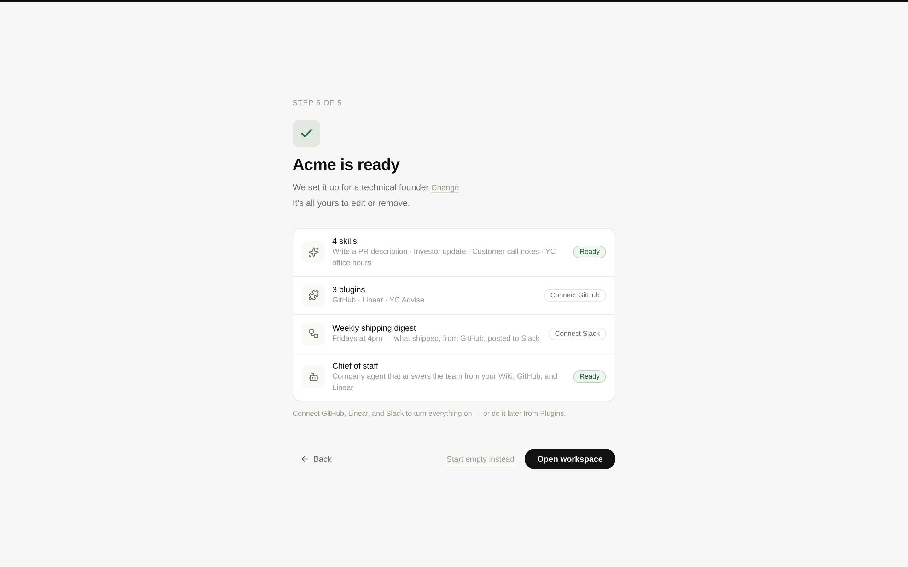
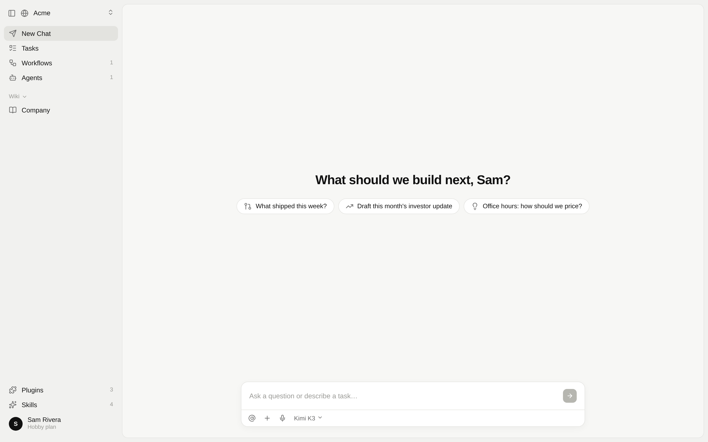
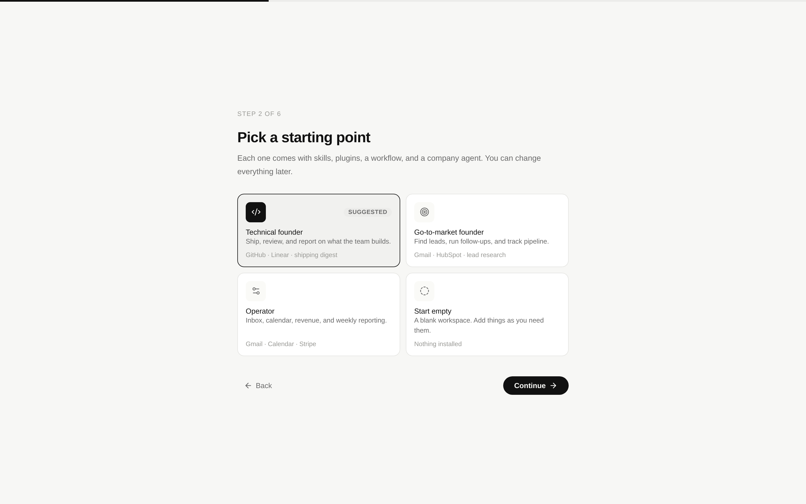
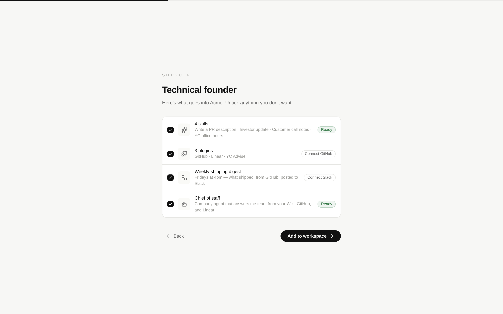
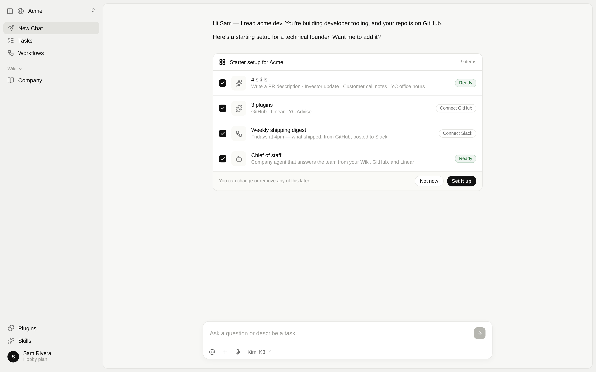
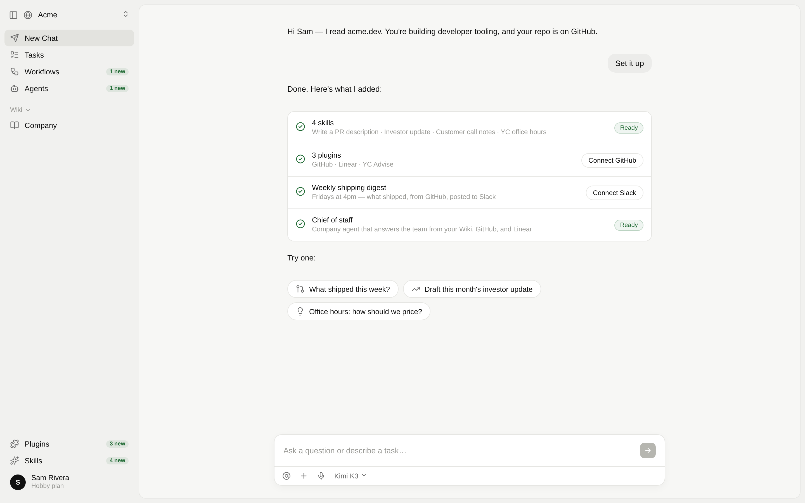

# Starter kits

Status: proposal. We still need to choose a direction. Clickable prototype:
[`starter-kits/prototype.html`](./starter-kits/prototype.html) (open it in a browser; it has no build step).

## Problem

A new workspace starts empty. Workspace creation seeds only the Company Wiki, and the first thing a
new user sees is "What should we build next?" with nothing under it. The Skills, Workflows, and
Agents pages then each show their own "No … yet" state. Users told us they want to start with
useful defaults. A technical founder should arrive with a few skills, the right plugins, a workflow,
and a company agent, and get to a first "aha" within about 30 seconds.

Much of what we need already exists:

- Onboarding already asks for a **role** and a **company URL** (`OnboardingWizard.tsx`). The role
  only changes suggested Wiki folders today (`onboardingFoldersForRole`), and nothing reads those.
- `WORKFLOW_TEMPLATES` already contains finished, runnable workflows, such as the weekly shipping
  digest.
- YC Advise is a skills-only plugin and needs no connected account.
- `queueOnboardingKickoff` can already auto-submit a first chat prompt, but nothing calls it.

## Principles

1. **A kit is content, not a feature.** A kit installs ordinary skills, plugins, a workflow, and an
   agent. There is no "template" object and no new page or setting. Undoing a kit means deleting
   those things with the controls that already exist.
2. **Don't ask twice.** We already know the role. Any new question has to earn its place.
3. **Show it, then get out of the way.** The aha is seeing your workspace already full, followed
   by one prompt that does real work.
4. **Work before anything is connected.** Every kit item is created at once. Items that need a
   connection are shown as "Connect GitHub" and are never hidden.

## The kit (same in every direction)

The technical founder kit:

| Kind | Contents | Works immediately? |
| --- | --- | --- |
| Skills | Write a PR description · Investor update · Customer call notes · YC office hours | Yes |
| Plugins | GitHub · Linear · YC Advise | YC Advise yes; GitHub and Linear need a connection |
| Workflow | Weekly shipping digest (existing template, Fridays 4pm) | Draft until GitHub and Slack are connected |
| Agent | Chief of staff: answers the team from the Wiki, GitHub, and Linear | Yes, from the Wiki |

The home screen shows three starter prompts for the kit: "What shipped this week?", "Draft this
month's investor update", and "Office hours: how should we price?".

The first version needs three kits, mapped from the eight existing roles:

- **Technical founder:** founder, product.
- **Go-to-market founder:** sales, marketing.
- **Operator:** operations, investing, consulting, research.

## Directions

### A · Starts ready (recommended)

The role picked on step 1 decides the kit. The existing plugins step recommends that kit's
plugins. The finish screen becomes "Acme is ready": a four-row list of what's in the workspace,
with a **Change** link in case we guessed the kit wrong and a **Start empty instead** link. The user
then lands on home with the counts filled in and the starter prompts showing.

- No new steps and no new concepts. The whole thing takes one screen that already exists.
- The outcome is deterministic and instant, with no model call on the critical path.
- Risk: a wrong guess from the role. The Change link and one-click deletes cover it.

### B · Pick a starter

This adds a "Pick a starting point" step after the profile step. It shows four cards, with the one
matching the role marked as suggested, then a preview where the user can untick items.

- The choice is explicit and so is the consent.
- Risk: two more screens for a choice most people will accept as suggested. It also turns the kit
  into a thing to shop for, which leads to demand for a gallery.

### C · Set up in chat

Onboarding stays as it is. The first chat opens with the agent, which has read the company URL and
proposes the kit as a card with "Set it up". After the user accepts, the card turns into a checklist
with Connect buttons and starter prompts.

- This is the strongest demo of the product itself: the agent doing work for you.
- Risk: the first 30 seconds depend on a model run (latency, cost, failures), and the proposal
  varies from one user to the next. "Not now" leaves the user as empty as they are today.

## Recommendation

**Ship A.** It is the simplest option that fully solves the problem. C's best idea, using the
company URL to personalize, can come later as a first-chat follow-up on top of a workspace that is
already full ("I read acme.dev, want me to tailor these skills?"). By then that prompt is a bonus
and not a gate.

## What building A takes

- **Kit definitions** live next to `WORKFLOW_TEMPLATES` in `apps/web`. They are typed data: skills
  (name, description, instructions), official plugin names, workflow template ids, agent
  (name, instructions), and starter prompts.
- **Seeding** happens server-side in onboarding `finish`, because API auth only allows plugin calls
  before onboarding is complete. It reuses the existing services:
  - `SkillImportApplicationService.create` for skills.
  - Plugin import for official plugins.
  - `createWorkflow` + `updateWorkflow` for the workflow template.
  - `CompanyAgentApplicationService` for the agent.
- **Idempotency:** seeding must be safe to retry. It should skip items that already exist by name.
- **Company agents are behind `companyAgentsEnabled`.** A kit that includes an agent must either
  enable the flag for the workspace owner or leave the agent out until the beta ends.
- **Home empty state** shows the kit's starter prompts. They disappear after the first chat.
- **Analytics:** record the kit applied, "Start empty", "Change", and which starter prompt was sent.
  This is how we find out whether the kit gets used.

## Open questions

- Should "Founder / CEO" map to the technical kit? It fits our current users, but a non-technical
  founder would see GitHub first.
- Should kit skills be company-scoped (shared with future teammates) or personal? The proposal is
  company-scoped, because the kit describes the company's setup.
- Should invited members, who skip the owner steps, see the starter prompts?
