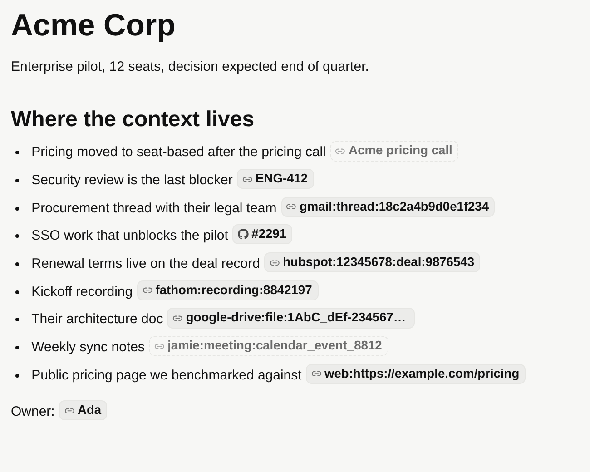
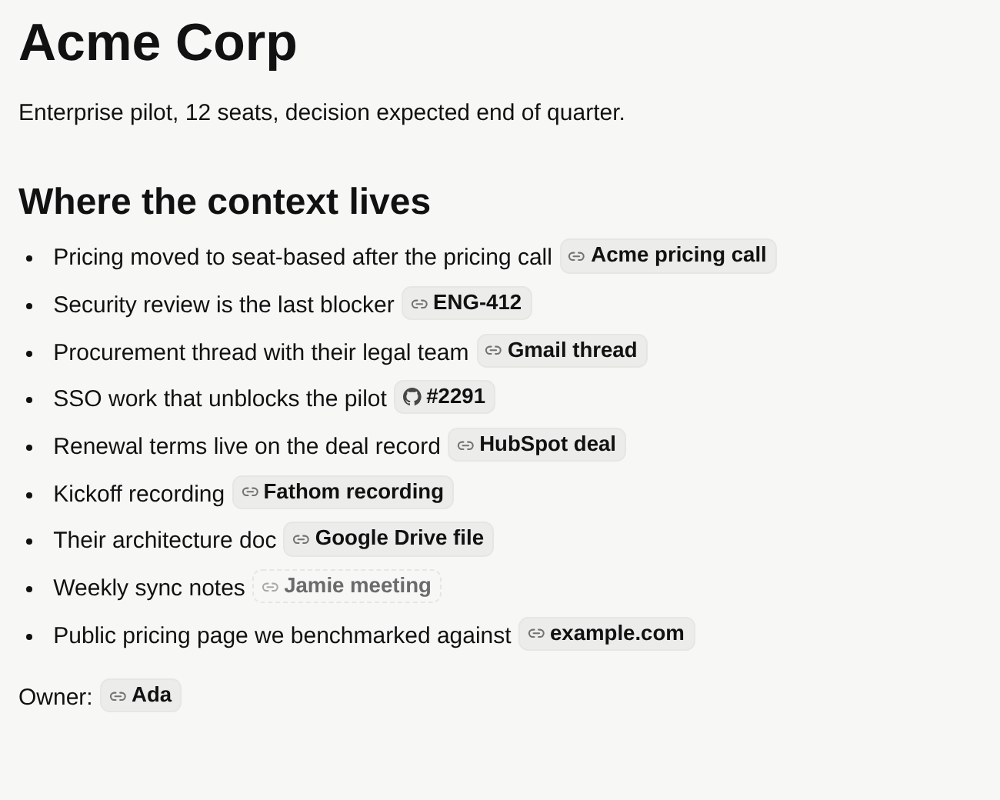

# Wiki source refs

How a wiki page points at something that lives in another tool — a Linear issue, a Gmail
thread, a Granola note, a GitHub PR.

## The rule

A wiki page keeps the **claim**. The other tool stays the **canonical home of the content**.
So a page cites a source by pointer, not by copy:

```markdown
Pricing moved to seat-based after the Acme call [[source:granola:note:note_8f21|Acme pricing call]].
Tracked in [[source:linear:issue:ENG-412]].
```

Copying a Linear description or an email body into a page creates a second copy that goes stale
the moment it is written, and readers have no way to tell which one is current. Copy only when
the source is ephemeral and cannot be re-fetched.

## Grammar

A source ref is `provider:id`, written inline as `[[source:provider:id]]` with an optional
`|Label`:

- `provider` — lowercase slug, `[a-z0-9][a-z0-9-]{0,63}`.
- `id` — the provider's own identifier. It may contain colons and slashes
  (`linear:issue:ENG-412` is provider `linear`, id `issue:ENG-412`) but no whitespace, brackets,
  or pipes, so the ref stays inline-link safe.
- The whole ref caps at 256 characters.

This is the same grammar the Brain uses, so refs move between the two verbatim. Shape validation
lives in `packages/wiki/src/schema.ts` (`isValidWikiSourceRef`, `parseWikiSourceRef`); parsing out
of page bodies lives in `packages/wiki/src/links.ts`. Valid refs are materialized into
`goat.wiki_links` with `kind = 'source'`, which is what powers per-page source listings.

## Known providers

`packages/wiki/src/sources.ts` is the single registry of provider grammars. It generates the ref
shapes embedded in the wiki tool description agents are prompted with, and it resolves the chips
the editor renders — so an agent is told the grammar that actually resolves.

| Ref shape | Chip label | Opens |
| --- | --- | --- |
| `linear:issue:<IDENTIFIER>` | `ENG-412` | `linear.app/issue/<id>` |
| `github:<owner>/<repo>[:pull\|issue:<number>[:comment:<id>]]` | `#412` / `owner/repo` | the repo, PR, issue, or comment |
| `gmail:thread:<threadId>` | Gmail thread | the thread in the `#all` view |
| `slack:conversation:<teamId>:<channelId>:<windowEndTs>` | Slack conversation | the channel |
| `google-drive:file:<fileId>` | Google Drive file | the file in its editor |
| `hubspot:<portalId>:<contact\|company\|deal>:<objectId>` | HubSpot deal | the record |
| `attio:<workspaceId>:<object>:<recordId>` | Attio deal | — (pointer only) |
| `granola:note:<noteId>` | Granola note | `app.granola.ai/notes/<id>` |
| `fathom:recording:<recordingId>` | Fathom recording | `fathom.video/calls/<id>` |
| `jamie:meeting:<eventId>` | Jamie meeting | — (pointer only) |
| `web:<https url>` | the hostname | the URL |

Use `web:<url>` for anything with no registered provider. Any provider may also carry a full
`https` URL as its id (`notion:https://notion.so/...`) — a canonical URL beats a grammar guess.

Attio and Jamie are **pointer only**: Attio's app URLs are keyed by workspace slug, which the ref
does not carry, and Jamie exposes no per-meeting web URL. Both still render as named chips so the
provenance is visible; they just do not link out. Guessing a URL from an id the provider did not
give us is how a citation turns into a broken promise.

Unregistered refs render as the raw `provider:id`; registered ones render as the artifact, and a
pointer-only provider stays visibly inert:

| Before | After |
| --- | --- |
|  |  |

## Failure behavior

Refs are validated by **shape**, not against the registry: an unknown provider or an id that does
not fit its provider's grammar still saves. It renders as an inert chip carrying the raw ref —
visible, not linked, and never silently dropped. A ref is never rewritten into a URL unless the id
matched the provider's pattern, so a malformed ref cannot produce an attacker-shaped link.

## Adding a provider

1. Add an entry to `WIKI_SOURCE_PROVIDERS` in `packages/wiki/src/sources.ts` with its `refShape`
   and a `describe(id)` that returns `null` for anything off-grammar.
2. Cover it in `packages/wiki/src/sources.test.ts`, including one malformed id.
3. Add the row to the table above.

The tool description, the chips, and the writers then agree by construction. Writers that mint refs
live in `packages/agent/src/actions/*`.
